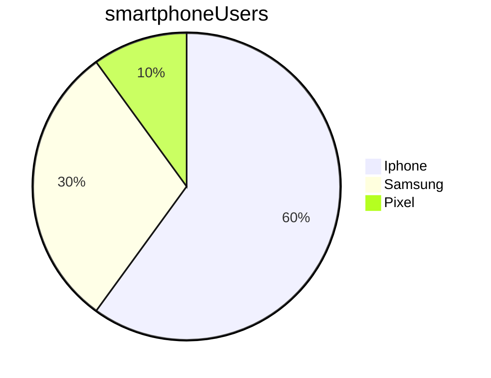

# Learning about Markdown

<!-- TOC -->
* [Learning about Markdown](#learning-about-markdown)
  * [How to do headings](#how-to-do-headings)
    * [Example of a subheading of the subheading](#example-of-a-subheading-of-the-subheading)
  * [General formatting](#general-formatting)
  * [Lists](#lists)
  * [Numbered lists](#numbered-lists)
  * [Images](#images)
  * [Links](#links)
  * [Code](#code)
<!-- TOC -->

## How to do headings

Use more hashes for smaller headings 

### Example of a subheading of the subheading

## General formatting

_Italics_

*this is also italics*

**Bold**

__This is also in bold__

> To be or not to be, that is the question
> > W. Shakespeare

## Lists

* item1
* item2
  * subitem1
    * sub-subitem1
    * sub-subitem2 
  * subitem2
* item3

Note: can use hyphens instead of stars

## Numbered lists

Note: use when sequence/order is importnat

1. first item
    * bullet point1
    * bullet point2
2. second item
3. third item

## Images


## Links

To a website:
[Google](https://google.com)

To a folder/file in your repo:
[README.md](../learning_variables/README.md)

## Code

Inline code example
To print something to the screen in python, use the `print()` function

Example of code over multiple lines:
```python
print('Hello')
print('Hello')
```

```bash
pwd
cd foldername
```

## Task list

- [ ] Item not done yet
- [x] This item is done

## Tables

Name    |   Street   |  Town
--------|------------|----------
Cathy   | Main St    | Birmingham
John    | Maple Drive  | Stafford
 
## Mermaid



needs the right software/plugin ``installed to render appropriate graphics